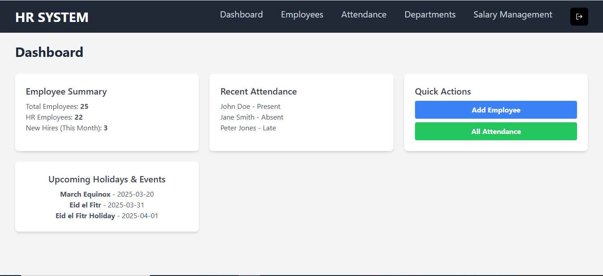
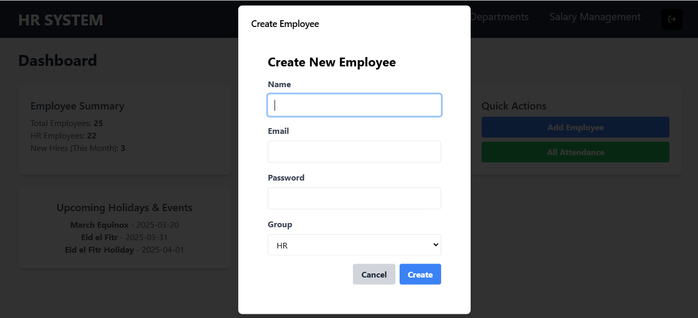
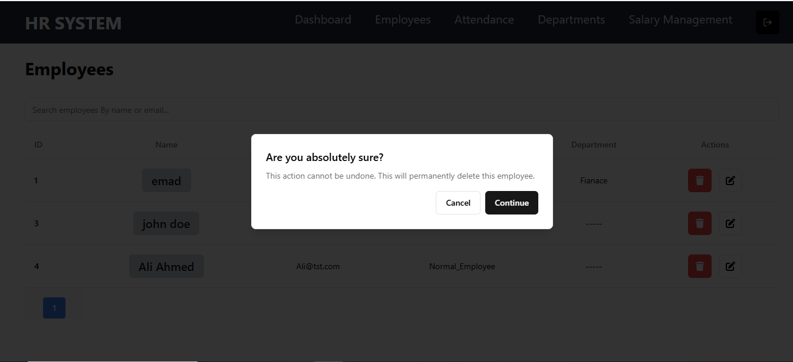
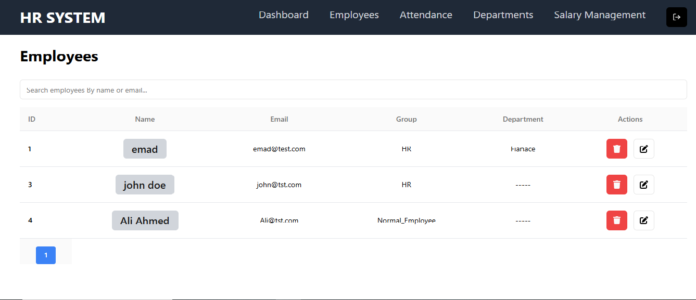
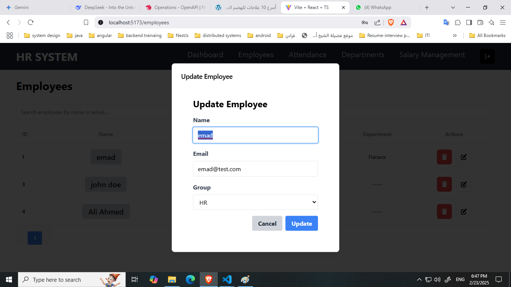
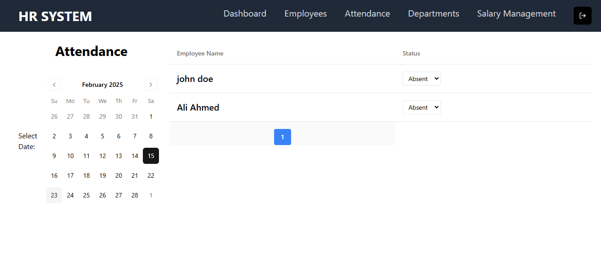
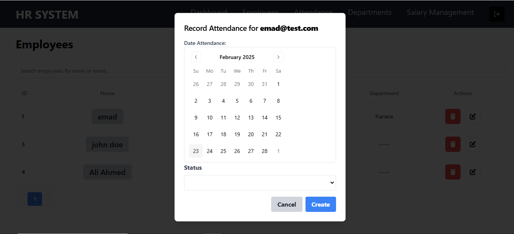
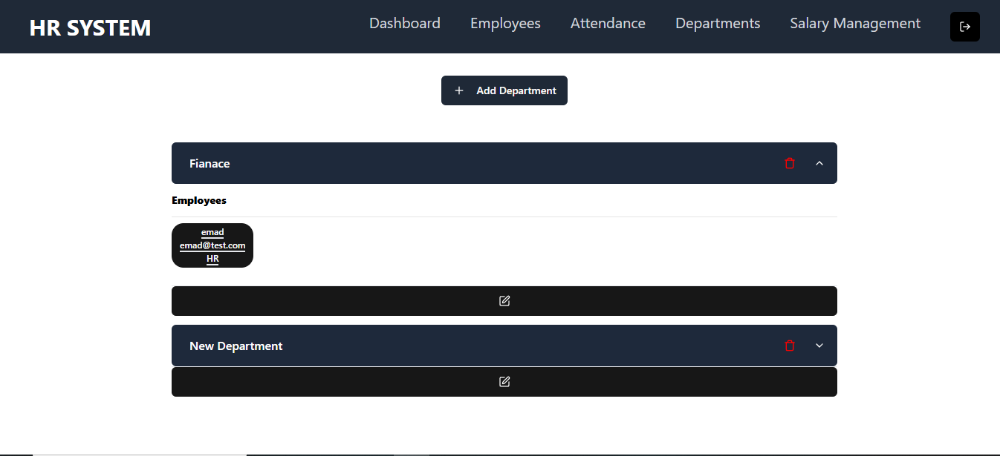
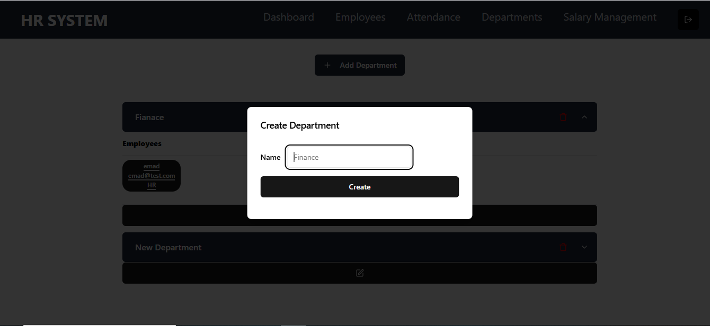
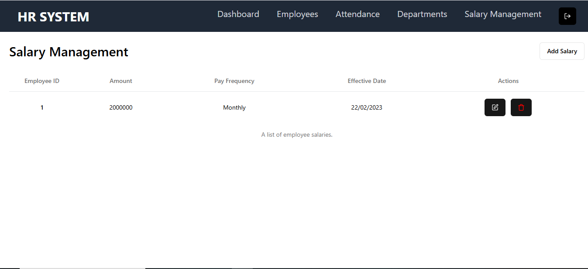

# HR System Backend - Employee & Salary Management

[](https://github.com/emadhashem/HR-SYSTEM-Backend/graphs/contributors)
[](https://github.com/emadhashem/HR-SYSTEM-Backend/commits/main)

## About Me

I'm Emad Hashem, a passionate software developer with a strong focus on backend development and system architecture. I believe in writing clean, maintainable, and scalable code that solves real-world problems. This project is a demonstration of my skills in designing and implementing complex systems, and my dedication to continuous learning and improvement.

This repository contains the backend component of a robust HR system, focusing on comprehensive Employee and Salary Management. Built with Nestjs, and designed for scalability and maintainability, this project is a testament to my commitment to building high-quality, efficient, and user-friendly applications.

## Features

This HR System Backend offers a range of features designed to streamline employee and salary management:

* **Employee Management:**
    * Comprehensive employee data storage (name, contact information, hire date, etc.).
    * Ability to assign employees to departments.
    * Efficient search and filtering capabilities.
    * user roles and permissions.
    * user Authentication and Authorization.


* **Salary Management:**
    * Detailed salary tracking with historical records.
    * Support for various pay frequencies (monthly, bi-weekly, etc.).
    * Record of effective date, for salary change tracking.
    * Intuitive UI for creating new salary records.
* **Robust Data Validation:**
    * Implementation of Zod for schema validation, ensuring data integrity.
    * All form fields are required, with clear error messages.
* **User-Friendly Interface (UI Focused):**
    * Modern and responsive UI using Tailwind CSS and Shadcn UI.
    * Dialog components for clean and efficient data input.
    * Employee search functionality within the salary creation form.
* **Secure Implementation:**
    * Focus on secure coding practices, including input validation.
    * Ready for JWT authentication.
* **Well-Documented Code:**
    * Clean, readable code with clear comments.
    * Type safety with Typescript.
    * Swagger for clean api-docs.
* **Comprehensive Testing:**
    * **Unit Tests:** Thoroughly tested service and utility functions to ensure reliability.
    * **End-to-End (E2E) Tests:** Validated API endpoints and user flows to guarantee seamless functionality.
    * **Performance Testing:** Load testing using k6, and performance monitoring with Grafana to ensure system stability under high load.

## Technologies Used

* **Backend:** Nest, SqlLite
* **UI:** Tailwind CSS, Shadcn UI, React.js, Typescript.
* **Data Validation:** Zod
* **Form Handling:** React Hook Form

## Getting Started

1.  **Clone the repository:**

    ```bash
    git clone [https://github.com/emadhashem/HR-SYSTEM-Backend](https://github.com/emadhashem/HR-SYSTEM-Backend)
    ```

2.  **Navigate to the project directory:**

    ```bash
    cd HR-SYSTEM-Backend
    ```

3.  ## Installation

    ```bash
    yarn install
    ```

4.  ## Running the app

    ```bash
    # development
    yarn run start

    # watch mode
    yarn run start:dev

    # production mode
    yarn run start:prod
    ```

5.  ## Test

    ```bash
    # unit tests
    yarn run test

    # e2e tests
    yarn run test:e2e

    # test coverage
    yarn run test:cov
    ```

6.  ## .env file Copy these vars to your .env file

    ```
    DATABASE_URL="file:./dev.db"
    JWT_SECRET=8ad0d7aa65a422118e71ce8dbc99927ac30bce00296593779502447334a7125d8af79159761046b9fc003d8be4537278d744e3d92f63020972fb06a17b2c96ff
    ```

7.  ## Database (prisma)

    ```bash
    # Generate
    npx prisma generate

    # Push
    npx prisma db push

    # Run the seed
    npx prisma db seed
    ```

8.  ## Login For first time:

    <p>email: emad@test.com</p>
    <p>password: 12345678</p>

## Front end of this project

<a href="https://github.com/emadhashem/HR-SYSTEM-Frontend" target="_blank">HR-SYSTEM-Frontend</a>

### Screenshots



_Dashboard Page_





_Employee Management Page_



_Attendance Management Page_



_Department Management Page_


_Salary Management Page_

## Future Enhancements

* Implementation of a full microservices architecture.
* Integration with a database (MongoDB, PostgreSQL, etc.).
* Expanding leave management and performance review features.
* Adding a leave management module.
* Integrating with a payroll system.
* Implementing a document management system.

## Contributing

Contributions are welcome! If you find a bug or have an idea for a new feature, please open an issue or submit a pull request.

## Contact

* **GitHub:** [My GitHub profile](https://github.com/emadhashem)
* **LinkedIn:** [My LinkedIn profile](https://www.linkedin.com/in/emad-hashem-629749332/)
* **Email:** emadhashem363@gmail.com

Thank you for checking out my project! I'm always looking for ways to improve and learn, so your feedback is highly appreciated.